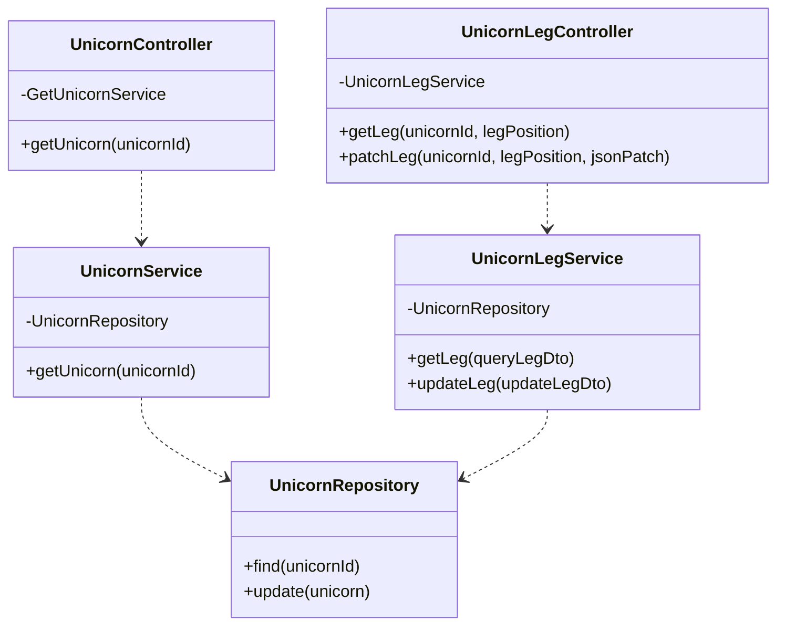
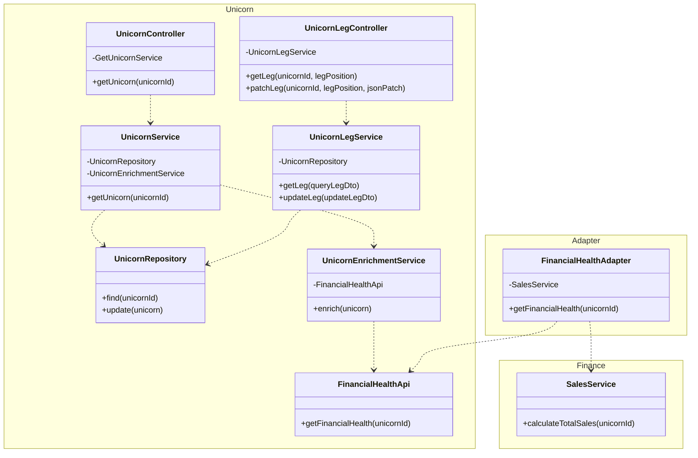
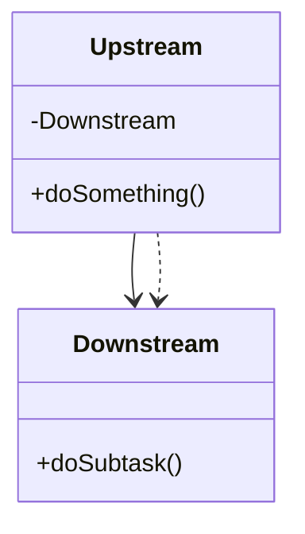
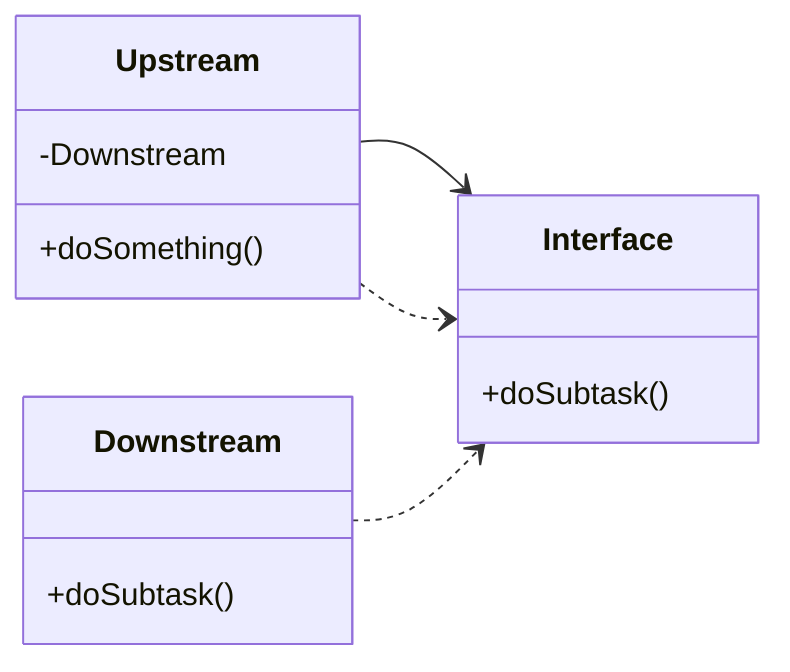
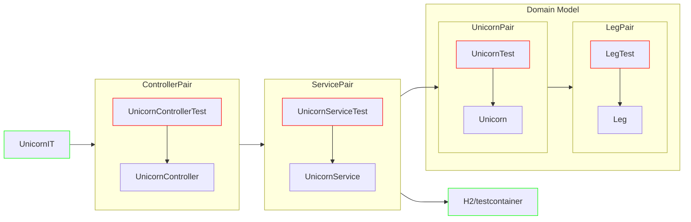
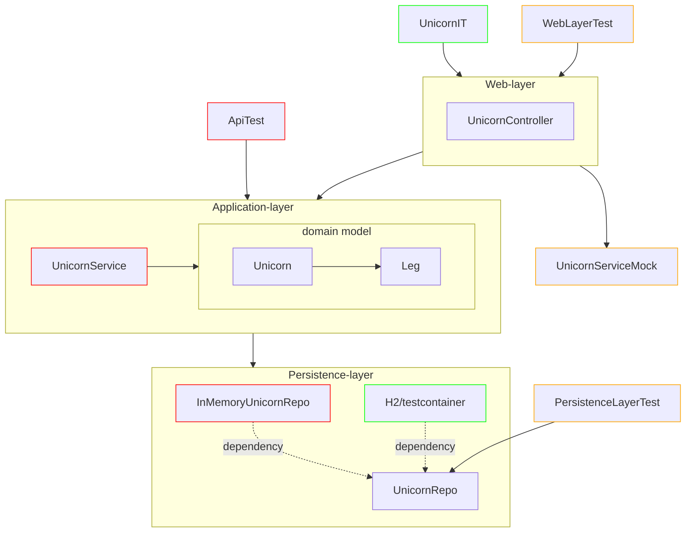
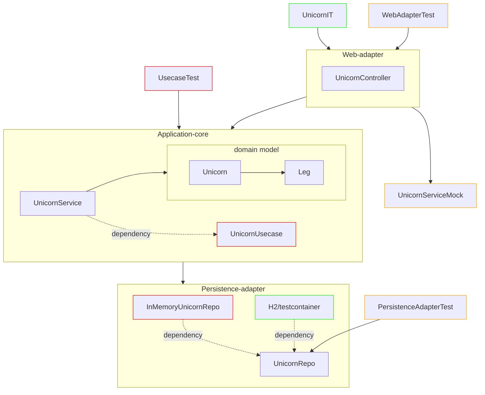

# Unicorn Backend Web MVC Application examples illustrating Hexagonal Architecture and Domain Driven Design

This repository shows a three-layer architecture using best-practices for decoupling of its layers. It also shows
an adapter pattern to decouple a bounded context. This application can be readily refactored to hexagonal architecture
as is shown in the unicorn-hexagonal repository. Java modules can then be easily introduced as shown in the
unicorn-modules repository.

For example requests to the Web API, see UnicornAppRequests.postman_collection.json

## Class diagram

Simplified class diagram for the unicorn bounded context:

Class diagram showing enrichment from the finance bounded context:

Instead of the regular depedency:

We make use of dependency inversion to decouple the two bounded contexts:

Test-per-class testing:

Api testing:

Testing with Hexagonal Architecture:

## Sources

- Get Your Hands Dirty on Clean Architecture, Tom Hombergs
- https://docs.aws.amazon.com/prescriptive-guidance/latest/hexagonal-architectures/welcome.html (ook in PDF formaat)
- Migrating your Spring Boot application to Java Modules by Jaap Coomans – YouTube (presentatie @ Devoxx)
- https://cleancoders.com/library/all (Clean Code series videos door Robert C. Martin, aka Uncle Bob)
- Agile Software Development: Principles, Patterns and Practices, Robert C. Martin (aka Uncle Bob)
- The Java Module System, Nicolai Parlog
- https://github.com/TomCools/jpms-hexagonal-architecture (voorbeeld project door Tom Cools)